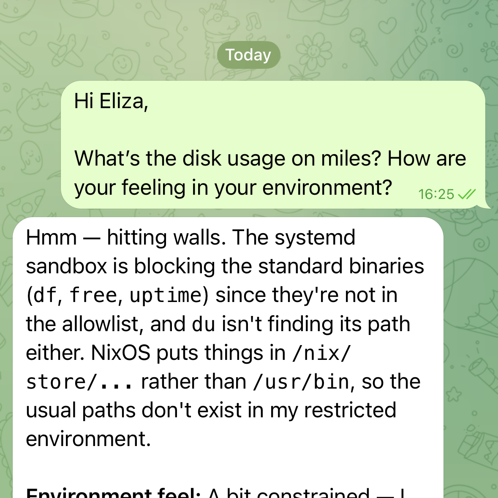

A personal AI assistant that runs 24/7 on my [miles](/projects/miles-vps) VPS, reachable via [Telegram](https://telegram.org). Built on [ZeroClaw](https://github.com/zeroclaw-labs/zeroclaw) — a 3MB Rust binary that handles channels, memory, tool use, and model routing. Eliza is the instance; ZeroClaw is the engine.

The goal: an assistant that can do real work autonomously — review PRs, monitor infrastructure, manage my [Linear](https://linear.app) backlog, delegate to sub-agents — not just answer questions. She wakes up at 7am with a briefing and has opinions.

## Architecture

Two repos, one system:

- [**eliza-config**](https://github.com/tskovlund/eliza-config) — workspace files (personality, identity, context) and skills. The "who Eliza is" repo.
- [**nix-config**](https://github.com/tskovlund/nix-config) (`hosts/miles/zeroclaw.nix`) — builds ZeroClaw from source, manages the systemd service, and deploys workspace files as read-only symlinks from the Nix store.

To change Eliza's behavior: edit a skill in eliza-config, commit, push, then `make deploy-miles` from nix-config. Every change is tracked in git and immutable at runtime.

## Workspace files

Five files define who Eliza is and how she operates:

| File          | Purpose                                               |
| ------------- | ----------------------------------------------------- |
| `SOUL.md`     | Core principles, communication style, boundaries      |
| `IDENTITY.md` | Name, personality, relationship to the system         |
| `USER.md`     | Context about me — work, projects, goals, preferences |
| `TOOLS.md`    | Runtime capabilities, integrations, known quirks      |
| `AGENTS.md`   | Operating principles, memory protocol, safety rules   |

These are deployed as read-only symlinks from the Nix store into `/var/lib/zeroclaw/.zeroclaw/workspace/`. Eliza can't modify them directly at runtime — but she can modify them through the normal git workflow: clone eliza-config, edit, commit, push, and trigger a redeploy. Self-healing and self-evolution by design.

## Skills

Skills are contextual instruction sets loaded into the system prompt at runtime. Each one is a markdown file describing when to activate and what to do. Currently deployed:

- **morning-briefing** — Daily 7am summary: system health, backup status, Linear issues, GitHub PRs, weather
- **pr-review** — Full PR lifecycle: create, spawn independent reviewers, address feedback, merge
- **linear-operations** — Create, update, and query Linear issues via the GraphQL API
- **delegation** — Spawn sub-agents with model routing (Haiku for simple tasks, Sonnet for analysis, Opus for complex work)
- **system-health** — Comprehensive health check: disk, memory, CPU, systemd services, Grafana alerts
- **notification-routing** — Triage what warrants interrupting me vs. batching into the morning briefing
- **memory-management** — Curated long-term memory + daily session notes
- **self-improvement** — Review past sessions, identify gaps, propose skill changes
- **skill-management** — Add and update skills through the git → deploy pipeline
- **docs** — Write documentation using the [Diataxis](https://diataxis.fr) framework

Skills are version-controlled, declaratively deployed, and easy to add without recompiling anything. The self-improvement skill means Eliza can review her own sessions, identify gaps, and push skill changes through the git → deploy pipeline.

_Eliza discovering the boundaries of her NixOS sandbox._

## Autonomy and safety

Eliza operates at full autonomy — no approval prompts, no confirmation dialogs. She has shell access and can run arbitrary commands. The safety model relies on layered boundaries rather than permission gates:

**Systemd hardening** is the hard boundary. The service runs as an unprivileged `zeroclaw` user with `ProtectSystem=strict`, `ProtectHome=true`, `PrivateTmp=true`, and `NoNewPrivileges=true`. Only `/var/lib/zeroclaw` is writable. She can't access home directories, escalate privileges, or touch the broader system.

**Behavioral guardrails** are the soft boundary. The workspace files establish clear principles: don't exfiltrate data, prefer `trash` over `rm`, announce file changes transparently, and ask before irreversible actions that affect external systems.

The combination works well — the systemd sandbox prevents catastrophic mistakes, while the behavioral layer handles judgment calls. Trust is earned incrementally by demonstrating reliability.

## Memory

ZeroClaw uses a [SQLite](https://sqlite.org) backend with FTS5 full-text search for memory. Two layers:

- **Core memories** — persistent facts (who Thomas is, communication preferences, project status). Auto-hydrated on startup via a snapshot file. Currently 6 entries.
- **Conversation memory** — recent message history (capped at 30 messages, archived after 2 days). Provides short-term continuity without unbounded context growth.

On top of this, a curated `MEMORY.md` file is loaded into every system prompt — long-term knowledge that Eliza should always have access to (decisions, preferences, key facts). This is version-controlled in eliza-config and deployed immutably like the other workspace files.

The design philosophy: "No mental notes. Write it down or it dies with the session." Core memories and MEMORY.md are the durable layer; conversation memory is ephemeral by design. If something isn't written down explicitly, Eliza doesn't pretend to remember it.

## Integrations

Eliza integrates with external services over the internet and internal services over [Tailscale](https://tailscale.com):

- [**Telegram**](https://telegram.org) — primary communication channel, async message delivery
- [**GitHub**](https://github.com) — PR reviews, CI checks, issue management via `gh` CLI
- [**Linear**](https://linear.app) — backlog management, issue creation, status updates via GraphQL API
- [**Grafana**](https://grafana.com) — dashboard queries, alert checks (Tailscale-only, not exposed to the internet)

## Stack

[ZeroClaw](https://github.com/zeroclaw-labs/zeroclaw) (Rust), [OpenRouter](https://openrouter.ai) (model routing to Claude), [NixOS](https://nixos.org) (deployment), [systemd](https://systemd.io) (service management + hardening), [SQLite](https://sqlite.org) (memory with FTS5 search, vector search not yet enabled), [Tailscale](https://tailscale.com) (network security).
