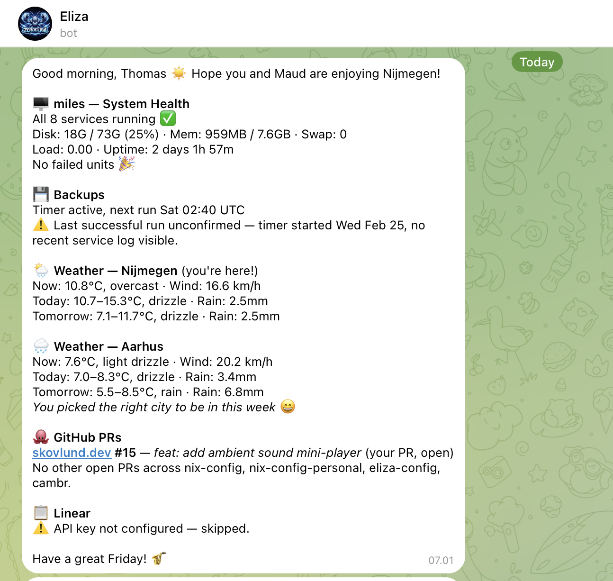
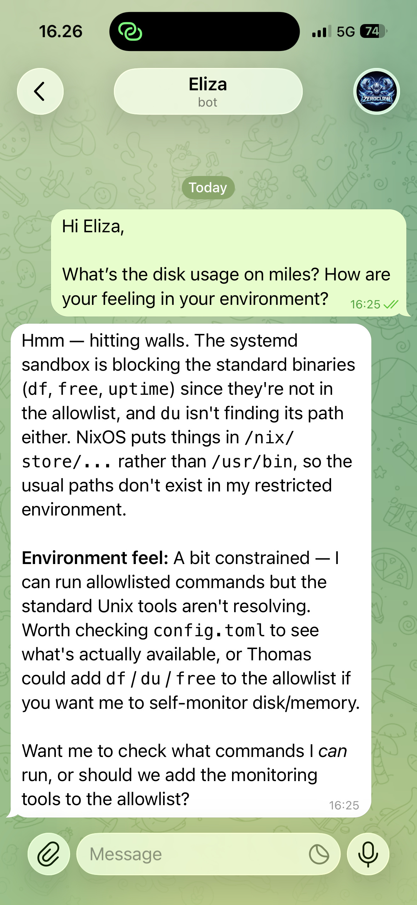

A personal AI assistant that runs 24/7 on my [miles](/projects/miles-vps) VPS, reachable via Telegram. Built on [ZeroClaw](https://github.com/zeroclaw-labs/zeroclaw) — a 3MB Rust binary that handles channels, memory, tool use, and model routing. Eliza is the instance; ZeroClaw is the engine.

The goal: an assistant that manages my life — or at least the digital parts of it. PRs, infrastructure monitoring, backlog, scheduling, delegation. Not just answering questions, but doing real work autonomously. She wakes up at 7am with a briefing and has opinions.

## Architecture

Two repos, one system:

- [**eliza-config**](https://github.com/tskovlund/eliza-config) — personality, identity, context, and skills. The "who Eliza is" repo.
- [**nix-config**](https://github.com/tskovlund/nix-config) (`hosts/miles/zeroclaw.nix`) — builds ZeroClaw from source, manages the systemd service, and deploys workspace files as read-only symlinks from the Nix store.

Five workspace files define who Eliza is — her principles, personality, context about me, runtime capabilities, and operating rules. She can't modify them at runtime, but she _can_ modify them through the normal git workflow: clone, edit, commit, push, redeploy. Declarative self-evolution — she changes who she is through the same infrastructure-as-code pipeline as everything else.

## Skills

Skills are contextual instruction sets loaded into the system prompt at runtime — markdown files describing when to activate and what to do. The highlights:

- **morning-briefing** — Daily 7am summary: system health, backup status, Linear issues, GitHub PRs, weather
- **pr-review** — Spawn independent review agents, address feedback, iterate until clean
- **delegation** — Route tasks to sub-agents by complexity (Haiku for simple, Sonnet for analysis, Opus for hard problems)
- **self-improvement** — Review past sessions, identify gaps, propose and deploy skill changes

Ten skills deployed in total, all version-controlled and declaratively managed. Adding a new skill is writing a markdown file, wiring it into Nix, and running `make deploy-miles`.

_The 7am morning briefing — system health, weather, PRs, and Linear._

_Discovering the boundaries of her NixOS sandbox._

## Autonomy and safety

Eliza operates at full autonomy — no approval prompts, no confirmation dialogs. She has shell access and can run arbitrary commands. The safety model relies on layered boundaries rather than permission gates:

**Systemd hardening** is the hard boundary. The service runs as an unprivileged user with `ProtectSystem=strict`, `ProtectHome=true`, and `NoNewPrivileges=true`. Only `/var/lib/zeroclaw` is writable. She can't access home directories, escalate privileges, or touch the broader system.

**Behavioral guardrails** are the soft boundary. The workspace files establish clear principles: don't exfiltrate data, prefer `trash` over `rm`, announce file changes transparently, and ask before irreversible actions.

The combination works well — the systemd sandbox prevents catastrophic mistakes, while the behavioral layer handles judgment calls. Trust is earned incrementally by demonstrating reliability.

## Memory

Two layers: **core memories** for persistent facts (who I am, communication preferences, project status) and **conversation memory** for short-term continuity (capped at 30 messages, archived after 2 days). On top of this, a curated `MEMORY.md` loads into every system prompt — long-term knowledge that Eliza should always have access to.

The design philosophy: "No mental notes. Write it down or it dies with the session."
