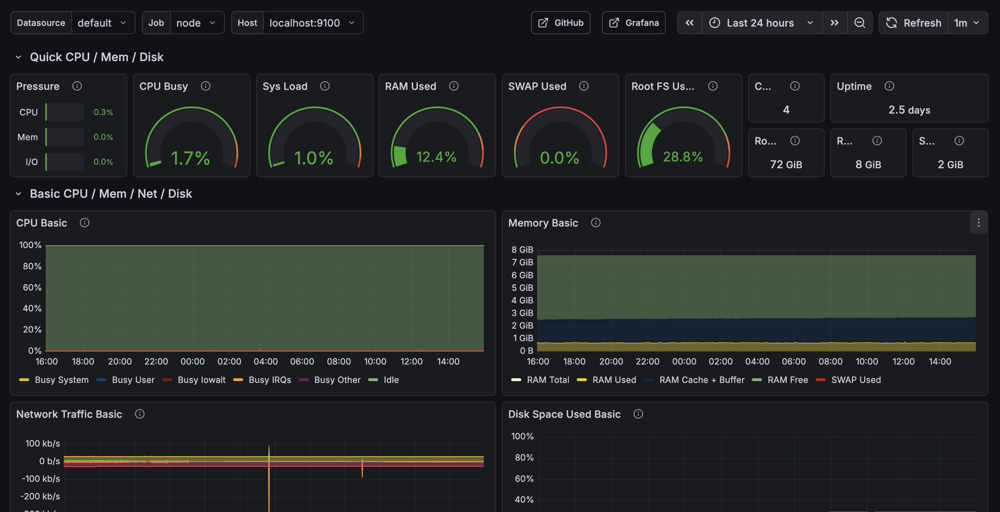
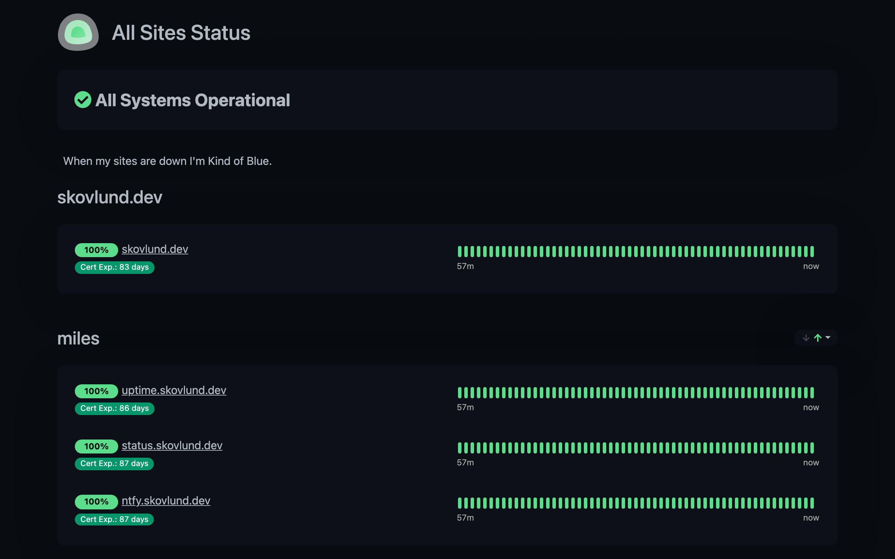
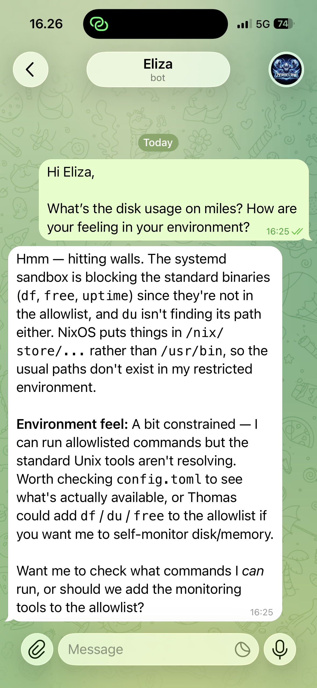

A self-hosted [NixOS](https://nixos.org) VPS running on [Hetzner Cloud](https://www.hetzner.com/cloud/), fully managed from my [nix-config](https://github.com/tskovlund/nix-config) repo. One `make deploy-miles` from my laptop rebuilds the entire system. Named after [Miles Davis](https://en.wikipedia.org/wiki/Miles_Davis) — I have a naming convention for my servers based on jazz legends, which is a very elaborate system for someone with exactly one server.

## What runs on it

- **Networking** — [Tailscale](https://tailscale.com) mesh VPN. SSH and nearly all services are only accessible via the Tailscale network — not exposed to the public internet. The only public-facing service is [Caddy](https://caddyserver.com) (reverse proxy with automatic HTTPS) serving a single [Uptime Kuma](https://github.com/louislam/uptime-kuma) status page.
- **Observability** — [Prometheus](https://prometheus.io) for metrics, [Grafana](https://grafana.com) for dashboards, [Loki](https://grafana.com/oss/loki/) and [Promtail](https://grafana.com/docs/loki/latest/send-data/promtail/) for log aggregation. Everything is behind [Tailscale](https://tailscale.com) — no public dashboards, no login pages exposed to the internet.
- **Uptime monitoring** — [Uptime Kuma](https://github.com/louislam/uptime-kuma) for uptime tracking. The admin UI is Tailscale-only. I monitor [randersbigband.dk](https://status.skovlund.dev/status/rbb) — I used to play in the band and still sub at rehearsals, so I offered to track their uptime and alert the maintainer if anything goes down. Their [status page](https://status.skovlund.dev/status/rbb) is the only route exposed publicly, via [Caddy](https://caddyserver.com) path restrictions.
- **Notifications** — [ntfy](https://ntfy.sh) for push notifications to my phone and laptop, plus [Resend](https://resend.com) for email alerts. I get notified about everything: successful daily backups, failed backups, high disk/memory/CPU usage, systemd service failures, and scrape health issues. Accessible only via [Tailscale](https://tailscale.com).
- **Backups** — [Restic](https://restic.net) snapshots to [Backblaze B2](https://www.backblaze.com/cloud-storage), running daily at 02:30 UTC. SQLite databases get `.backup` snapshots before archiving for consistency. Success and failure notifications via [ntfy](https://ntfy.sh) so I always know whether last night's backup ran.
- **AI assistant** — [ZeroClaw](https://github.com/zeroclaw-labs/zeroclaw), an autonomous AI assistant connected to [Telegram](https://telegram.org). Built from source via a Nix flake input. Still figuring out how much autonomy to give it — as the screenshot below suggests, the NixOS sandbox keeps things interesting.

_Node Exporter dashboard — CPU, memory, disk, and network at a glance._

_All green on the Uptime Kuma status page._

_ZeroClaw politely learning the boundaries of its NixOS sandbox._

## How it's managed

Every piece of this infrastructure is declared in [Nix](https://nixos.org) modules under `hosts/miles/` in [nix-config](https://github.com/tskovlund/nix-config). No manual server configuration, no imperative setup scripts, no drift. The entire system — packages, services, firewall rules, users, secrets — is described in code and deployed atomically.

Secrets (API keys, backup credentials) are managed with [agenix](https://github.com/ryantm/agenix) and age-encrypted at rest. The deployment flow: edit Nix code locally, `make check` to validate, `make deploy-miles` to build and activate on the VPS over SSH.

## Security

- Key-only SSH authentication (no passwords), accessible only via [Tailscale](https://tailscale.com)
- [fail2ban](https://github.com/fail2ban/fail2ban) for brute-force protection
- Kernel hardening via sysctl (SYN cookies, no IP forwarding, reverse path filtering)
- [Hetzner Cloud Firewall](https://docs.hetzner.com/cloud/firewalls/overview) as an additional network-level layer
- Automatic NixOS upgrades tracking nixos-unstable
- [Grafana](https://grafana.com) alert rules for disk, memory, CPU, systemd failures, and scrape health — problems don't go unnoticed
