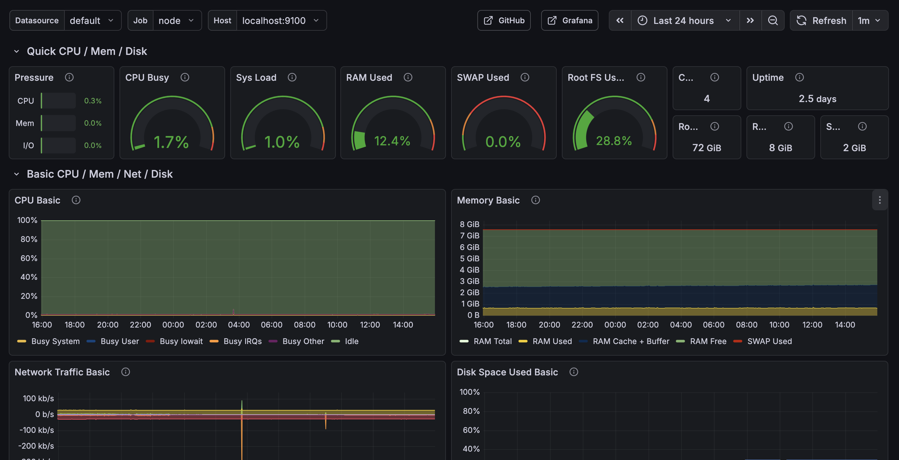
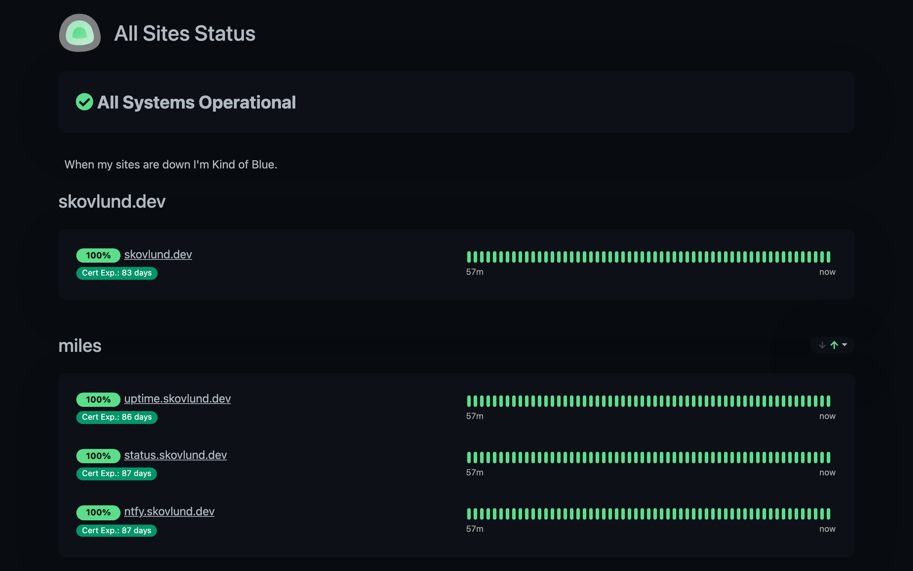

A self-hosted NixOS VPS running on [Hetzner Cloud](https://www.hetzner.com/cloud/), fully managed from my [nix-config](/projects/nix-config) repo. One `make deploy-miles` from my laptop rebuilds the entire system. Named after [Miles Davis](https://en.wikipedia.org/wiki/Miles_Davis) — I have a naming convention for my servers based on jazz legends, which is a very elaborate system for someone with exactly one server.

## What runs on it

- **Networking** — [Tailscale](https://tailscale.com) mesh VPN keeps nearly everything off the public internet. The only public-facing service is a single [Uptime Kuma](https://github.com/louislam/uptime-kuma) status page behind [Caddy](https://caddyserver.com).
- **Observability** — [Prometheus](https://prometheus.io) for metrics, [Grafana](https://grafana.com) for dashboards, Loki and Promtail for log aggregation. All Tailscale-only.
- **Uptime monitoring** — Uptime Kuma tracks my own services and [randersbigband.dk](https://status.skovlund.dev/status/rbb) — I used to play in the band and still sub at rehearsals, so I offered to keep an eye on their site.
- **Notifications** — [ntfy](https://ntfy.sh) push notifications and [Resend](https://resend.com) email alerts. I hear about everything: backups, disk usage, systemd failures, scrape health.
- **Backups** — [Restic](https://restic.net) snapshots to Backblaze B2, daily at 02:30 UTC. SQLite databases get `.backup` snapshots before archiving for consistency.
- **AI assistant** — [Eliza](/projects/eliza), an autonomous agent that manages my life — morning briefings, PR reviews, backlog, the works. All through Telegram.

_Node Exporter dashboard — CPU, memory, disk, and network at a glance._

_All green. "When my sites are down I'm Kind of Blue."_

## How it's managed

Every piece of this infrastructure is declared in Nix modules under `hosts/miles/` in [nix-config](https://github.com/tskovlund/nix-config). No manual server configuration, no imperative setup scripts, no drift. Secrets are [agenix](https://github.com/ryantm/agenix)-encrypted at rest. The deployment flow: edit locally, `make check`, `make deploy-miles` over SSH.

## Security

The short version: key-only SSH via Tailscale, fail2ban, kernel hardening, Hetzner Cloud Firewall, automatic NixOS upgrades, and Grafana alert rules for everything that might go wrong. Nothing is exposed to the public internet except a single status page. The long version: [read the code](https://github.com/tskovlund/nix-config).
