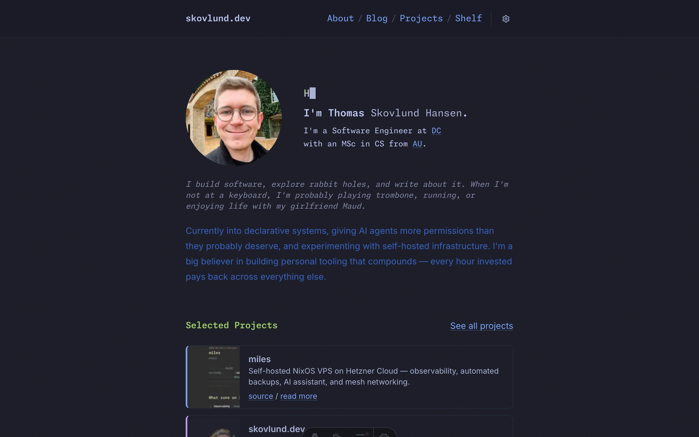
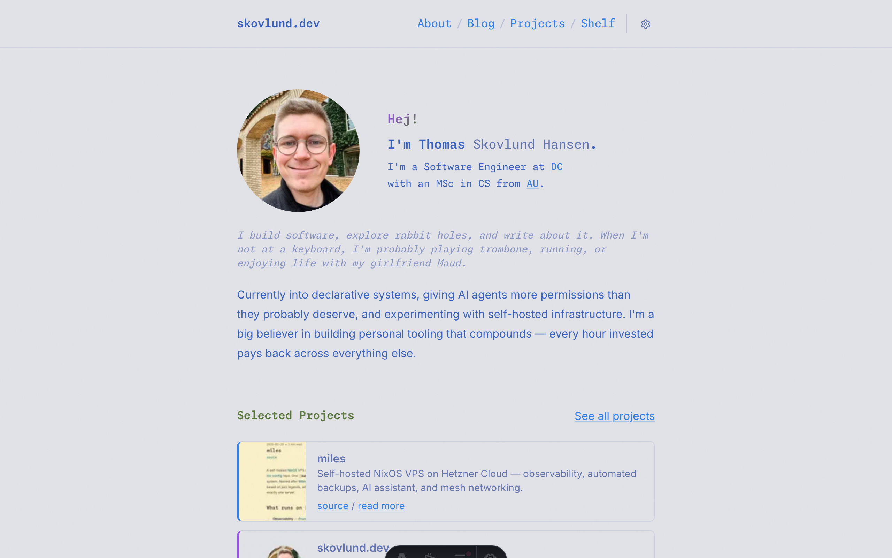

My personal website and blog — and an experiment in AI-augmented development. The entire site was built using [Claude Code](https://github.com/anthropics/claude-code) without writing a single line of code myself. Every component, every style, every accessibility feature was authored by an AI coding agent, directed by human intent.

## Tech stack

- **[Astro 5](https://astro.build)** — static site generator with content collections and View Transitions
- **[Tailwind CSS 4](https://tailwindcss.com)** — CSS-first config, no JavaScript config file
- **[TypeScript](https://www.typescriptlang.org)** — strict mode, explicit types everywhere
- **[Cloudflare Pages](https://pages.cloudflare.com)** — deployed via [GitHub Actions](https://github.com/features/actions) on push to main

## Design

The default theme is [Tokyo Night](https://github.com/enkia/tokyo-night-vscode-theme), but the site ships with 12 switchable color schemes — all built on CSS custom properties. Light, dark, and system theme modes with class-based switching and instant transitions.

Page navigations use Astro's [View Transitions API](https://docs.astro.build/en/guides/view-transitions/) for a seamless, app-like feel. The header and footer persist across navigations — they never re-render. Content fades in with a subtle 200ms transition. First-visit gets a stagger reveal animation; subsequent navigations skip the wait.

All user-facing strings live in a single i18n file — components handle layout, not copy. This keeps content easy to find and update.

## Quality

It's a portfolio piece, so I hold it to a high standard:

- **[ESLint](https://eslint.org)** with strict [typescript-eslint](https://typescript-eslint.io) rules — explicit return types, naming conventions, no abbreviations
- **WCAG 2.1 AA** accessibility — skip links, keyboard focus indicators, ARIA attributes, reduced motion support, semantic HTML
- **Perfect [Lighthouse](https://developer.chrome.com/docs/lighthouse/) scores** — 100 across performance, accessibility, best practices, and SEO
- **Git hooks** — pre-commit lints staged files, pre-push runs the full build
